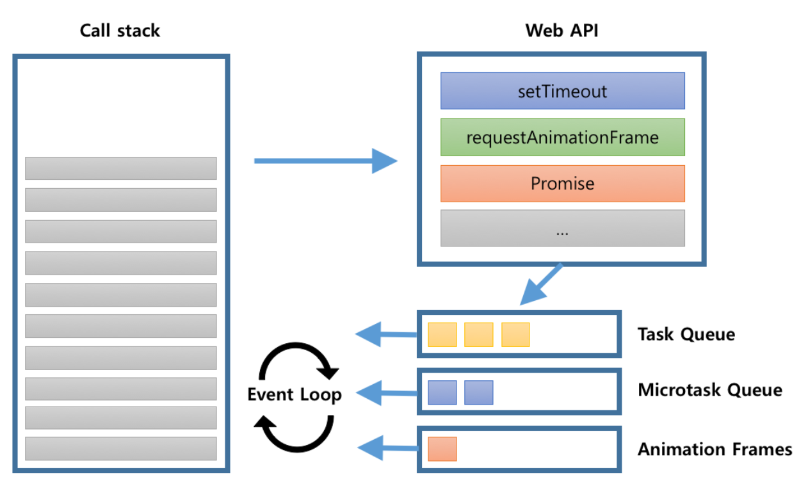

> 자바스크립트는 싱글스레드로 동작한다. 함수가 호출되면 실행 컨텍스트가 생성되어 콜스택에 Task가 쌓이게 되고, 한 번에 하나의 Task를 수행할 수 있다는 뜻이다. 그런데 오늘날의 웹 애플리케이션 환경에서는 동시에 일어나는 것 같은 동시성을 제공하는 서비스가 많다. 


## Memory Heap, Call Stack
자바스크립트의 V8 엔진 내부를 들여다보면, 코드를 해석하고 실행하기 위해 다양한것들이 존재하지만, 이벤트루프를 설명하기 위해 중요한 힙과 스택영역이 있다.

- `Memory Heap` : 데이터, 변수가 할당되는 메모리 공간
- `Call Stack` : 함수 실행시 생성되는 **실행컨텍스트**, 콜백함수 Task가 쌓이는 공간

동시성을 제공하기 위해, V8엔진에서 제공하는것은 이게 전부다. 거창한 비동기 프로그래밍을 구현하는 무언가가 있지 않다. 실제로 그 해답은 런타임환경에 있다.

<br />


## 런타임환경
자바스크립트는 대표적으로 `브라우저`, `Node.js` 환경에서 실행된다. 실행되는 환경, 플랫폼 자체를 **런타임환경** 이라고 부르며, 브라우저는 웹 애플리케이션의 동시성을 제공하기 위한 다양한 API를 제공한다.

## Web API
브라우저는 다수의 멀티쓰레드 환경을 제공한다. 중용한건 V8 엔진은 싱글스레드 환경이며, 멀티스레드 환경인 브라우저에 임베디드되어 동작한다는 것이다. 위의 사진에서 알 수 있듯이, 다양한 Web API들은 함수를 실행하기 위해 `Network-Thread`, `Dom-Event-Thread`, `Timer-Thread` 등 다양한 멀티쓰레드 환경에서 동작한다.
예를들어 아래 코드는 다음과 같은 실행순서를 가진다.  

```javascript
setTimeout(
  () => console.log('5 seconds'),
5000);
``` 

1. `setTimeout`함수가 실행되며, 실행 컨텍스트가 생성되어 콜스택에 올라간 뒤 실행된다.
2. 콜스택에서 실행한 `setTimeout` WebAPI는 브라우저의 `Timer-Thread`에 의해 5초 뒤 콜백함수를 `callback-Queue`로 전달하며 역할을 다한다.


## Callback Queue
콜백 큐는 말 그대로, 선입선출 방식의 콜백 함수들을 보관하는 자료구조이다. 위에서 `setTimeout`함수가 실행되며, 5초 뒤 콜백함수를 `callback-Queue`에 전달한다. 콜백 큐는 콜 스택에 올라가기를 기다리며 콜백함수들을 잠시 보관해두는 용도일 뿐이며, (Normal)Task, MicroTask, Animation Frames 3가지 차등한 우선순위를 가진다.

- `MicroTask` : `Promise` 객체의 resolved 된 콜백함수들이 담긴다.
- `AnimationFrames` : `requestAnimationFrame`의 콜백함수들이 담긴다.
- `(Normal)Task` : 그 외의 일반적인 WebAPI(`setTimeout`)들의 콜백함수들이 담긴다.


<br />  




<br />

아래 코드를 보면, 실행순서와 다른 우선순위에 의한 호출결과를 확인할 수 있다.  

```javascript
setTimeout(
  () => {
    console.log('1. setTimeout');
}, 0);

requestAnimationFrame(
  () => {
    console.log('2. requestAnimationFrame')
  }
);

Promise.resolve()
  .then(() => console.log('3. Promise resolved'))
  .then(() => console.log('4. Promise then'));

/** 
 * ============ 결과 ============
 * 3. Promise resolved
 * 4. Promise then
 * 2. requestAnimationFrame
 * 1. setTimeout
 * */

```  

## Event Loop
이벤트 루프는 **콜스택이 비었을 때 마다, 테스크 큐의 우선순위에 맞게 콜백함수를 콜 스택에 올리는 역할**을 한다. 조금더 엄밀히 말하자면 우선순위를 기다리던 콜백함수가 실행되고, 생성된 실행 컨텍스트가 쌓이는 과정이다. 콜 스택은 비동기나 동시성은 관심없고, 스택에 쌓이는 실행 컨텍스트를 하나씩 처리 할 뿐이다. 위 내용을 이해한다면 자바스크립트의 비동기 함수들이 실행되는 과정은, 결코 '동시'에 일어나는건 아니지만, '**동시에 일어나는 것 처럼**' 느껴진다. 이것이 **자바스크립트의 동시성**이고, 런타임 환경에 의해 웹 애플리케이션의 비동기 동작을 수행한다고 이해할 수 있다.


## 정리
자바스크립트는 싱글스레드 언어이다. 언어를 해석하고 실행하는 런타임 환경에 따라 멀티쓰레드를 이용한 동시성을 제공하는 것이며, 모던 웹 환경에서는 동시성에도 우선순위가 있다는것을 이해하고 잘 분류해서 사용하자.


## Reference
- https://d2.naver.com/helloworld/5237120