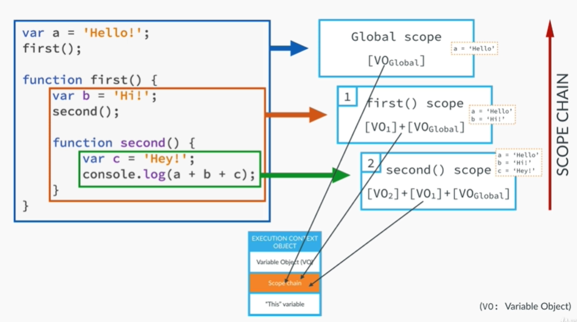

> 자바스크립트에서 제일 중요한건 함수라 해도 무방하다. 함수의 실행단위로 어플리케이션이 동작하고, 함수가 실행되어 생성되는 자료구조가 곧 실행 컨텍스트다. 즉, 자바스크립트를 구성하는 다양한 개념들은 실행 컨텍스트를 기본적으로 이해하고 있어야만 정확하게 이해하고 사용할 수 있다.


## Context 종류
기본적으로 자바스크립트는 Function Scope라는 말을 들어본적이 있을것이다. 이 말은 곧, 함수 단위로 스코프가 생성된다는 뜻인데, 실행컨텍스트 내에 생성되는 스코프 요소의 범위가 함수 단위인것이다. 자바스크립트는 전역함수 컨텍스트와 함수단위 컨텍스트가 존재하며 함수가 실행될 때 마다 콜스택에 컨텍스트가 생성되고 처리된다.

`Global Execution Context`
- 브라우저의 Window
- 전역변수

`Function Execution Context`
- 함수가 호출될 때 마다 생성
- 지역변수

함수가 실행되면서, 자바스크립트 엔진 내부에 있는 콜스택에 어떤 형태로 쌓이는지 확인해보자. 

```javascript
01    // ------------------------ (1)
02
03    var a = 10;
04
05    function outer() {
06       function inner() {
07          console.log(a); // undefined
08          var a = 20;
09       }
10       inner(); // ------------ (2)
11       console.log(a) // 10
12    }
13
14    outer(); // --------------- (3)
15    console.log(a); // 10
16
```

```
                                 |--------|
                                 | inner  |
                      |--------| |--------| |--------|
                      | outer  | | outer  | | outer  |
|        | |--------| |--------| |--------| |--------| |--------| |        |
|        | | global | | global | | global | | global | | global | |        |
|--------| |--------| |--------| |--------| |--------| |--------| |--------|

               01       14, 05     10, 06       11         15
               [1]        [2]        [3]        [4]        [5]        [6]
```

- [1] : 자바스크립트 코드가 실행되자마자 `global context` 생성
- [2] : `outer()` 함수 호출시 `function outer(){}` 의 정보를 담은 `function context` 생성 
- [3] : `inner()` 함수 호출시 `function inner(){}` 의 정보를 담은  `function context` 생성
- [4] : `function outer(){}` 의 제일 마지막 코드가 실행되고 `function context` 종료
- [5] : `function inner(){}` 의 제일 마지막 코드가 실행되고 `function context` 종료
- [6] : `global context`의 제일 마지막 코드가 실행되고 `global context` 종료

## Context 구성
엄밀히 말하면 Variable-Environment, Lexical-Environment, This binding 으로 구성된다. 솔직히 렉시컬 환경이라는 단어는 영어 그대로 이해하는 것 말고는 방법이 없다. 렉시컬이라는 단어를 해석할 완벽한 단어가 없다. 변수정보를 그대로 복사하여 런타임 과정에서 렉시컬 환경정보를 갱신하는 구성인데, 너무 복잡하다보니 이해하기 쉽게 변수객체, 스코프체인으로 정리하는게 낫지 싶다.  


 

#### 1. Variable Object(V.O) 변수객체
현재 스코프에 위치하는 변수(지역변수/매개변수) 및 함수선언에 대한 정보를 가지고있다. 이 과정에서 그 유명한 호이스팅이 발생하는것이다. 솔직히 깔끔하게 이해되진 않는데, 정확히 말하면 자바스크립트의 모든 코드들이 컴파일 되는 과정에서 문자열이 쪼개지는 토큰화(렉싱), 파싱(AST 트리 형성)을 통해 변수에 대한 모든 정보를 알고있기 때문에 실행컨텍스트를 구성할 수 있는것이고, 컴파일과 실행 컨텍스트가 50%씩 기여하여 호이스팅이라는 개념을 갖게 된 것이 아닌가 싶다.

#### 2. Scope Chain
현재 스코프의 변수객체 및 상위 스코프의 변수객체에 접근가능한 체인이 형성된다. 스택형태의 구조이기 때문에 자신보다 먼저 생성되어 스택에 쌓여있는 변수객체에 접근이 가능하다고 이해하면 되며, 클로저라는 키워드도 스코프 체이닝으로 인해 제공되는 중요한 개념이다.

#### 3. This
그 유명한 (`this`)[https://max-im.netlify.app/Javascript/this/] 키워드가 나온다. 실행컨텍스트에서 this를 깊게 다루기보단, 런타임 환경에서 참조값이 계속 변경될 수 있다는것만 기억하고, 위에 링크에서 자세히보자.


## 정리
실행컨텍스트는 자바스크립트의 실행단위인 함수로 인해 생성되는것이고, 자바스크립트의 동작 개념을 이해하는 데 매우 필수적이다. 호이스팅, 클로저라는 개념을 이해하기 위해서도 반드시 알고 있어야 한다.


## Reference
- https://medium.com/@nazanindelam/all-you-need-to-learn-to-understand-javascript-execution-context-and-stack-3babbdd88868