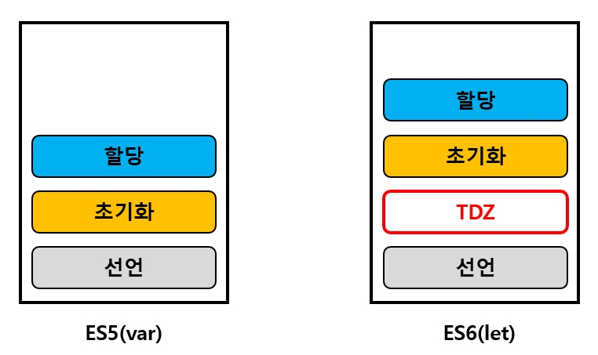

> 자바스크립트의 변수 선언 부분이 문서의 최상단으로 끌어올려지는 성질.
물리적으로 코드가 이동하는 것은 아니지만 그렇게 동작한다고 단순 언어적 스펙으로 설명하는 서적, 블로그들이 많다. 프로그래밍에서 그냥은 없다. 이 글에서는 조금 더 '왜'에 집중하여 정리 해 보자.


## 호이스팅은 어떻게 일어나는 것인가
호이스팅은 w3C 명세에 표준으로 기술되어있지 않다. 물리적으로 변수의 '선언'부분이 이동하는건 아니지만, 그렇게 동작하긴 한다. 조금더 자세히 말하자면, 함수가 호출되어 실행컨텍스트가 생성되어 변수객체 자료구조에 식별자 정보가 담긴다. 이때 ECMA 문서 스펙에 따라, TDZ의 영향을 받는지의 차이에 따라 `Reference Error` 또는 `undefined` 결과를 출력할 뿐이다.

## TDZ
자바스크립트에서 변수를 메모리공간에 확보시키는 과정이 있다. 

- 선언 : `var a;`
- 초기화 : `var a = 10`
- 할당 : `a = 20`

ES6 이후, `let`, `const`, `class` 키워드가 등장하며, `TDZ(Temporary Dead Zone)` 개념이 등장했다. 그림과 같이, **변수가 초기화 되기 전에 위치한 가상의 공간으로, 초기화되지 않은 변수에 접근할 경우 `Reference Error`가 발생하며, TDZ의 영향을 받았다** 라고 해석할 수 있다.  



## Not affected by TDZ
ES5 까지의 변수 선언 방식은 `var` 키워드를 사용한다. 해당 키워드를 사용해 변수를 선언하면, **선언과 동시에 초기화가 이루어진다.**

```javascript
console.log('1', a); // undefined
console.log('2', b); // undefined
var a; // 변수 a는 선언과 동시에 undefined로 자동 초기화된다.
var b = 10; // 변수 b를 선언과 동시에 10으로 초기화 했다.
console.log('3', b); // 10

---- 호이스팅 과정 ----
var a; // 선언과 동시에 undefined 
var b; // 선언과 동시에 undefined 
console.log('1', a);
console.log('2', b);
b = 10; // 선언과 동시에 초기화했지만, 실제 할당은 여기서
console.log('3', b);

```


## Be affected by TDZ
ES6 이후의 변수 선언방식은 `let/const` 키워드가 추가되었다. 해당 키워드를 사용해 변수를 선언하면, **선언과 동시에 초기화가 이루어지지 않는다.**

```javascript
console.log('1', a);
console.log('2', b);
let a; // 변수 a는 선언과 동시에 undefined로 자동 초기화된다.
const b = 10; // 변수 b를 선언과 동시에 10으로 초기화 했다.
console.log('3', a); // undefined
console.log('4', b); // 10

---- 호이스팅 과정 ----

let a;    // 선언과 초기화 되지 않았다.
const b;  // TDZ 의 영향을 받기 때문에 throw Error('Reference Error')
console.log('1', a); // throw Error('Reference Error')
console.log('2', b); // throw Error('Reference Error')
b = 10;
console.log('3', a); // undefined
console.log('4', b); // 10

```

## 함수 선언식 vs 함수 표현식
- `함수 선언식` : **선언식 전체**가 최상단으로 호이스팅 된다.
- `함수 표현식` : **변수 선언부분**만 호이스팅 된다.

```javascript
console.log('1', hello);
console.log('2', hi);
hello();
hi();

function hello() {
  console.log('hello');
}

var hi = function() {
  console.log('hi');
}

---- 호이스팅 과정 ----
function hello() {
  console.log('hello');
}
var hi = undefined;

console.log('1', hello); // function hello() { ... }
console.log('2', hi);    // undefined
hello(); // hello
hi(); // hi is not function

hi = function() {
  console.log('hi');
}

```
## 함수의 매개변수 호이스팅
매개변수도 결국 **변수**다. 

```javascript
function fn(a){
    console.log('1', a);
    var a = 20;
    console.log('2', a);
}

fn(10);

---- 호이스팅 과정 ----
function fn(a = 10) {
  var a;
  console.log('1', a); // 10
  a = 20;
  console.log('2', a); // 20
}

fn();

---- 호이스팅 과정 ----
function fn() {
  var a; // 매개변수의 선언부분
  a = 10; // 사실 var paramA = 10 도 무방하다.
  var a;

  console.log('1', a); // 10
  a = 20;
  console.log('2', a); // 20
}

fn(10);

```

다음은 `call by value`, 매개변수의 호잉스팅과정을 복합적으로 설명하는 코드다.

```javascript
function fn(b){
    console.log('1', a, b);
    var a = 20;
    console.log('2', a, b);
    b = 30;
    console.log('3', a, b);
}
var a = 10;
fn(a);
console.log(a);

---- 호이스팅 과정 ----
function fn(b) { ... }
var a;
a = 10;

fn(a);

... fn 내부 ..

function fn(b = 10) {
  var a;
  console.log('1', a, b);
  a = 20;
  console.log('2', a, b);
  b = 30;
  console.log('3', a, b);
}
console.log(a);

---- 호이스팅 과정 ----
function fn(b) { ... }
var a;
a = 10;

fn(a);

... fn 내부 ..

function fn() {
  var b;
  b = 10;
  var a;
  console.log('1', a, b); // undefined 10
  a = 20;
  console.log('2', a, b); // 20 10
  b = 30;
  console.log('3', a, b); // 20 30
}

console.log(a); // c-b-v에 의해 유지. 10

```


## 변수 선언과, 함수 선언식의 호이스팅 우선순위
놀랍게도 **호이스팅 간의 우선순위**가 존재한다. 스펙을 찾진 못했지만 적어도 브라우저마다 호이스팅하는 우선순위가 존재함을 코드로 확인하자. 하지만 스펙이 아니기 때문에 단정지을 순 없고, 호이스팅 과정에 대한 유추만 가능하다.

적어도 변수가 끌어올려지는 위치와, 함수 선언식 전체가 끌어올려지는 위치를 굳이 명시하자면, **함수 선언식의 호이스팅 위치가 제일 최상단**이라는 것을 '크롬/사파리' 브라우저에서 확인할 수 있다.

```javascript
var a = 10;
function a() {
  console.log('func a');
}
function b() {
  console.log('func b');
}
var b = 20;

console.log(a);
console.log(b);

---- 호이스팅 과정 1 ----
function a() {
  console.log('func a');
}
function b() {
  console.log('func b');
}
var a;
var b;

a = 10;
b = 20;

console.log(a);
console.log(b);

---- 호이스팅 과정 1 ----
function a() {
  console.log('func a');
}
function b() {
  console.log('func b');
}
var a = 10;
var b = 20;

console.log(a);
console.log(b);

```

## Reference
- https://developer.mozilla.org/ko/docs/Glossary/Hoisting
- https://www.freecodecamp.org/news/what-is-the-temporal-dead-zone/
- https://stackoverflow.com/questions/33198849/what-is-the-temporal-dead-zone/33198850#33198850
- https://hyojin96.tistory.com/entry/%EC%8A%A4%EC%BD%94%ED%94%84%EC%97%90-%EB%8C%80%ED%95%B4%EC%84%9C
- 코어 자바스크립트(도서)