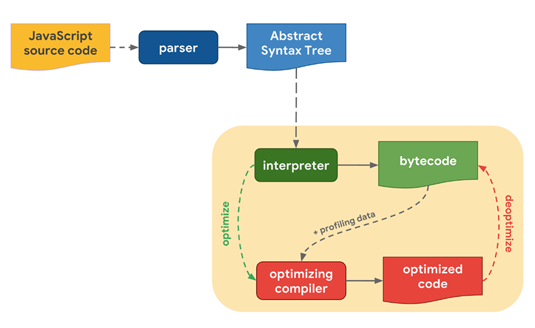

> 자바스크립트는 인터프리터 방식으로 실행된다. 브라우저의 개발자도구에서 스크립트를 작성하여 실행하는 데 컴파일 프로세싱이 필요없기 때문이다. **자바스크립트 언어를 해석하고 실행하는 엔진 내부를 깊게 들여다보면, 분명히 컴파일 과정을 거친다.** 구글의 V8 엔진 등장으로 자바스크립트의 성능은 향상되었고, 오늘날 프론트엔드 개발자 라는 직업을 만드는 데 큰 기여를 했다고 생각한다. 아마 컴파일 과정을 통해 내부엔진의 성능향상이 없었다면 프론트엔드 개발자 보다는 아직도 웹 개발자로 남지 않았을까.


## V8 Engine, JIT Compiler
자바스크립트는 브라우저 뿐만 아니라, 비 브라우저 환경인 Node.js 환경에서도 사용된다. 브라우저와 Node.js에서는 `V8 Engine`을 탑재하여 동작한다. V8 엔진은 인터프리터에 의해 코드를 한줄한줄 해석하는데, 내부의 최적화 컴파일방식을 통해 자바스크립트를 **바이트코드**로 컴파일한 뒤 실행하는 방식을 채택하였다. 즉, 이러한 방식을 JIT(Just-In-Time) 컴파일 이라 하며, **V8 엔진은 JIT 컴파일 기법을 사용한 JIT 컴파일러** 라고 말할 수 있다. V8 엔진은 변환된 바이트 코드를 읽으며 애플리케이션을 실행하는 것이다.


## Javascript Engine Pipeline
크롬 브라우저를 예로 들면 문서를 읽는 렌더링 엔진 `Blink`, 자바스크립트를 해석하는 V8 엔진으로 구성되어있다. V8 엔진은 아래 **파이프라이닝 컴파일과정**을 통해 바이트코드를 생성하고 최적화된 바이트 코드를 실행함으로써 오늘날의 웹 애플리케이션을 동작시키는 것이다.


    


1. 자바스크립트 엔진은 소스코드를 파싱 후 [AST](https://ko.wikipedia.org/wiki/%EC%B6%94%EC%83%81_%EA%B5%AC%EB%AC%B8_%ED%8A%B8%EB%A6%AC) 생성
2. `Ignition(Compiler)`에 의해 AST를 **'최적화되지 않은'** 바이트코드 생성
3. 그대로 바이트코드를 실행할 수도 있고, V8 엔진은 최적화 과정을 거치기도 한다.
4. `bytecode` + `profiling data`을 `Turbo Fan(optimizing compiler)` 에게 전달
5. 프로파일링된 데이터를 통해 자주 사용되는 변수, 함수를 기반으로 `optimized bytecode` 를 생성한다.
6. 최적화 된 바이트코드 프로파일링이 **실패**하였다면, 다시 `deoptimized bytecode`를 반환한다.
7. TurboFan은 이름 그대로 V8 엔진의 과열된 최적화 과정을 컨트롤하며, 실행 할 바이트코드를 분류한다.
8. 컴파일 과정을 거친 bytecode가 실행된다.

## How to read Javascript Code?
자바스크립트 파일은 `.js` 형식의 텍스트 파일인데, V8 엔진은 이를 어떻게 읽고 해석할 수 있을까?
V8 엔진은 파싱하기 전에, `UTF-16` 변환과 `Scanner`를 통한 `Token` 생성 과정을 거친다. 이때 생성되는 토큰들은 개발자가 정의한 `변수`와 `함수` 들이다. 

호이스팅을 말하기 까지 여기까지 오게되었다. 호이스팅이 어떻게 발생하는지 뭔가 예상이 되는 과정 중 하나다.


## Parsing to AST
V8의 `Parser`는 생성된 토큰을 이용해 AST를 생성한다. AST는 트리형태의 구조화 된 소스코드이며, 컴파일 과정에 사용된다. 아래 AST 트리를 구성하는 코드를 보면 더욱 확실해 진다. 이미 자바스크립트 엔진은 `console.log` 함수호출 코드를 읽기 이전에 AST를 형성하는 과정에 `name` 변수의 존재를 알고 트리를 구축하고있다. 쉽게 말하면, AST를 형성하기 위해 전체 코드를 미리 한번 훑어본다고 이해하면된다.

[AST JSON Converter](https://astexplorer.net/)
```javascript
console.log('name', name);
var name = 'hi';
------------------AST JSON Convert------------------
{
  "type": "Program",
  "start": 0,
  "end": 46,
  "body": [
    {
      ...
    },
    {
      "type": "VariableDeclaration",
      "start": 27,
      "end": 43,
      "declarations": [
        {
          "type": "VariableDeclarator",
          "start": 31,
          "end": 42,
          "id": {
            "type": "Identifier",
            "start": 31,
            "end": 35,
            "name": "name"
          },
          "init": {
            "type": "Literal",
            "start": 38,
            "end": 42,
            "value": "hi",
            "raw": "'hi'"
          }
        }
      ],
      "kind": "var"
    }
  ],
  "sourceType": "module"
}

```

```javascript
function Person(name) {
  this.name = name || '';
}
------------------AST JSON Convert------------------
{
  "type": "Program",
  "start": 0,
  "end": 52,
  "body": [
    {
      ...
    }
  ],
  "sourceType": "module"
}
```
## Ignition
V8 엔진의 인터프리터다. AST 트리를 해석하여 bytecode 를 생성한다. 한줄 한줄 읽으며, 필요할 때 컴파일 과정을 거치는 것이다. 위에 설명한 것 처럼 `profiling data` + `bytecode`를 TurboFan에게 전달하여 최적화 바이트코드를 기대하는것이다.


## TurboFan
V8 엔진의 최적화 컴파일을 위해 항상 가열되고, 열을 식히는 역할이다. 최적화된 바이트코드를 반환하기도 하고, 최적화가 불가능하다면 `deoptimized bytecode`를 다시 반환한다.

## 정리
Javascript 코드는 인터프리터에 의해 해석되고 실행된다. 인터프리터가 있는 V8 엔진 내부를 들여다보면, 최적화를 위한 JIT 컴파일이 발생하여 오늘날 '컴파일러 언어'에 버금가는 성능을 브라우저에서 제공하는것이다.

## Reference

- [Javascript](https://developer.mozilla.org/ko/docs/Web/JavaScript)
- [JITC](https://ko.wikipedia.org/wiki/JIT_%EC%BB%B4%ED%8C%8C%EC%9D%BC)
- [V8](https://ko.wikipedia.org/wiki/V8_(%EC%9E%90%EB%B0%94%EC%8A%A4%ED%81%AC%EB%A6%BD%ED%8A%B8_%EC%97%94%EC%A7%84))

- https://meetup.toast.com/posts/77
- https://kyoun.tistory.com/197
- https://ichi.pro/ko/jaba-seukeulibteu-enjin-gaeyo-36708011348359
- https://github.com/im-d-team/Dev-Docs/blob/master/Javascript/Javascript_Engine.md
- https://velog.io/@noyo0123/%ED%83%80%EC%9E%85%EC%8A%A4%ED%81%AC%EB%A6%BD%ED%8A%B8-VSCODE-%EA%B0%9C%EB%B0%9C%EC%84%B8%ED%8C%85%ED%95%98%EA%B8%B0-lfk2a3yuo5
- https://pks2974.medium.com/v8-%EC%97%90%EC%84%9C-javascript-%EC%BD%94%EB%93%9C%EB%A5%BC-%EC%8B%A4%ED%96%89%ED%95%98%EB%8A%94-%EB%B0%A9%EB%B2%95-%EC%A0%95%EB%A6%AC%ED%95%B4%EB%B3%B4%EA%B8%B0-25837f61f551
- https://hyojin96.tistory.com/entry/%EC%8A%A4%EC%BD%94%ED%94%84%EC%97%90-%EB%8C%80%ED%95%B4%EC%84%9C
- https://blog.sessionstack.com/how-javascript-works-parsing-abstract-syntax-trees-asts-5-tips-on-how-to-minimize-parse-time-abfcf7e8a0c8