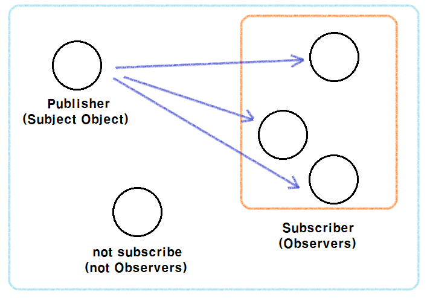

> 옵저버 패턴은 어렵지 않다. 브라우저의 `addEventListener(event, cb)` 함수가 이미 옵저버 패턴을 활용한 개념이라고 볼 수 있다. 이벤트를 등록해두면, 이벤트가 발생할 때 브라우저가 알려주며 브라우저와 이벤트는 1:N 방식의으로 이벤트가 바인딩되었다고 이해할 수 있다. 이처럼 옵저버 패턴은 1:N 방식의 의존성을 가진 디자인 패턴이다. Youtube의 구독자와 발행자 관계를 생각하면 된다.(유투브 아키텍처를 그렇게 설게했다는것은 결코 아니다..) 프론트엔드에서 생각 할 개념은 FE 측면의 어플리케이션 상태값이다. 퍼블리셔는 상태값을 참조하다가, 변화가 발생하면 구독자들에게 알려주는 형태의 디자인 패턴이다.
**Publisher === Subject**
**Subscriber === Observer** 
단어가 생소하더라도 잘 기억해보자




## Subject
발행자 `Subject` 최상위 클래스를 기준으로 인터페이스를 구성하고, 프론트엔드 상태값 `State` 클래스에서 발행주체를 상속받는다. 

```javascript
[Subject.js]

export default class Subject { 
  constructor() {
    this.observers = []; // 상태를 갱신해 줄 옵저버들을 배열형태로 받아준다.
  }

  // 상태값이 변경되면 알려 줄 옵저버를 추가한다.
  addObserver(o): void {
    this.observers.push(o);
  }

  addObservers(observerList): void {
    observerList.forEach(o => this.observers.push(o));
  }

  // 구독해제를 위해 옵저버를 제거한다.
  removeObserver(o): void {
    const index: number = this.observers.findIndex(observer => o);

    if (index != -1) this.observers.splice(index, 1);
  }

  // 데이터와 함께 상태값이 변경됨을 공지한다.
  notify(data) {
    if (this.observers.length) this.observers.forEach(o => o.update(data));
  }
}

```

프론트엔드 영역에서 다룰 뷰 상태값을 구현하기 위해 Subject를 상속했다. 즉, 컴포넌트들은 해당 State를 참조하게 될 것이고, 이는 `Redux` 라이브러리의 store 개념이라고 봐도 무방하다.

```javascript
[State.js]

import Subject from '@lib/Subject';

export default class State extends Subject {
  constructor(initialState = {}) {
    super();
    this.state = initialState;

    this.updateState = this.updateState.bind(this);
    this.getState = this.getState.bind(this);
  }

  // 상태값을 업데이트할 때 기존 상태값에 데이터를 추가하여 공지해준다.
  updateState(data = {}) {
    this.state = Object.assign(this.state, data);
    // this.state = {...this.state, data};
    // 스프레드와 차이점은, 스프레드는 항상 '새로운 객체를 생성하지만 assign은 기존 객체를 변경합니다.
    this.notify(this.state);
  }

  getState() {
    return this.state;
  }
}
```

## Observer
옵저버는 각 컴포넌트로써 구현되기 위한 껍데기이며, 상태값인 발행자에 대해 접근이 가능하다. 각 옵저버들은 위의 `Subject` 코드에서 알 수 있듯이, 발행자의 옵저버리스트에 등록되어있다가 상태값이 변경되면 `update` 함수가 호출될 뿐이다. 

```javascript
[Observer.js]

export default class Observer {
  // store는 곧 발행객체다
  constructor(store) {
    this.store = store;
    this.state = this.store.getState();
  }

  /**
   * 상태값이 변경되면 각 컴포넌트가 update한다.
   */
  render() {}
  update() {
    this.render();
  }
}

```


## Component
컴포넌트는 옵저버를 상속하여 인터페이스를 확장하고있다. 컴포넌트들은 `store`를 구독하고있고, 변경이 있을때마다 `render` 함수가 호출되기를 기다리며 새롭게 렌더링할 템플릿을 데이터와 바인딩하여 리턴해준다. 프론트엔드 개발의 대표적 라이브러리인 `React.js`의 컴포넌트 형태와 비슷한 인터페이스를 가지게 설계해보았다.


```javascript
[CarouselComponent.js]

import { Observer } from "@lib";

export default class Carousel extends Observer {
  constructor(store, parentSelector) {
    super(store);

    this._parentSelector = parentSelector;
  }
  
  createTemplate() {
    const { index, list } = this.state;

    return `
      
    `
  }

  render() {
    const parentElement = document.querySelector(this._parentSelector);
    parentElement.innerHTML = this.createTemplate();
  }
}

```

```javascript
[CarouselNextComponent.js]
import { Observer } from "@lib";

export default class CarouselNext extends Observer{
  constructor(store, parentSelector) {
    super(store);
    
    this._parentSelector = parentSelector;

    // bind 풀면, this가 window 가리킨다.
    this.handleNext = this.handleNext.bind(this);
  }

  createTemplate() {
    return `
      <button type="button" id="carousel-next">></button>
    `;
  }

  render() {
    const parentElement = document.querySelector(this._parentSelector);
    parentElement.innerHTML = this.createTemplate();

    this.bindEvents();
  }

  handleNext() {
    const { updateState } = this.store;
    const { index, list } = this.state;

    const nextIndex = index === list.length - 1 ? 0 : index + 1;

    updateState({
      ...this.state,
      index: nextIndex
    });
  }

  bindEvents() {
    const buttonNext = document.querySelector('#carousel-next');
    buttonNext.addEventListener('click', this.handleNext);
  }
}

```

## index

```javascript

(async function() {
  'use strict';
  const store = new State(initialState);

  const carousel = new Carousel(store, "#carousel");
  const carouselNext = new CarouselNext(store, "#carousel-buttons-next");
  const carousePrev = new CarouselPrev(store, "#carousel-buttons-prev");
  const carouselThumb = new CarouselThumb(store, "#carousel-thumb");
  const carouselThumbNext = new CarouselThumbNext(store, "#carousel-thumb-buttons-next");
  const carouselThumbPrev = new CarouselThumbPrev(store, "#carousel-thumb-buttons-prev");

  // 컴포넌트들은 전역 store 발행자를 구독하고있다.
  // store : 발행자
  // 컴포넌트 : 구독자
  store.addObservers([
    carousel,
    carouselNext,
    carousePrev,
    carouselThumb,
    carouselThumbNext,
    carouselThumbPrev,
  ])

  // 최초 렌더링
  carousel.render();
  carouselNext.render();
  carousePrev.render();
  carouselThumb.render();
  carouselThumbNext.render();
  carouselThumbPrev.render();
})();
```

## 정리
옵저버 패턴을 이용해 뷰 컴포넌트를 만들어보았다. 상태값을 참조하고있다가, 변경이 감지되면 컴포넌트의 템플릿이 데이터와 바인딩되어 리렌더링된다는 점에서 간편하다고 볼 수 있다. 컴포넌트(옵저버)의 `updateState` 함수를 호출하여 발행자의 state를 갱신하고, 발행자는 상태값을 변경한뒤 자신을 구독중인 모든 옵저버에게 새로운 상태값을 전파하는 구조다.

## DEMO
- https://limjungmok.github.io/vanilla-ts-scss/


## Reference
- https://webdevstudios.com/2019/02/19/observable-pattern-in-javascript/
