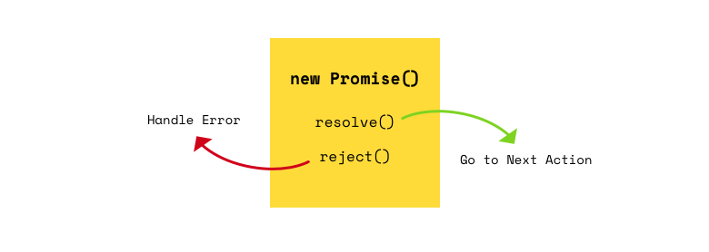

> Promise는 자바스크립트의 비동기 처리에 사용되는 객체다. 비동기 처리는 곧, 브라우저 런타임에서 멀티스레드 환경을 활용하는것이다. 대표적으로 브라우저의 Timer, Network 쓰레드를 사용하는 `setTimeout`, `fetch` API 를 통해 동시성을 제공하는 비동기 프로그래밍이 가능하다.


## Pending, Fulfilled, Rejected



- `pending` : 프로미스 객체가 생성된 직후의 상태
- `fulfilled` : 프로미스 객체의 콜백함수가 성공적으로 실행되고, `resolved` 된 상태
- `rejected` : 프로미스 객체의 콜백함수가 실패하여 `rejected` 된 상태


```javascript
function sum(a, b) { return a + b }
function delayTime(ms, fn) {
  return new Promise(function(resolve, reject) {
    setTimeout(function() {
      const result = fn();

      if (result) resolve(result);

      reject(new Error('delayTime Failed'));
    }, ms);
  })
}

delayTime(3000, () => sum(10, 20)).then(function(data) {
  console.log('fulfilled', data); // 30
}).catch(function(err) {
  console.log('rejected', err);
});

```

## Async/Await
`ECMA2017` 에서 등장한 키워드이며, 함수 내에서 `Promise`객체를 반환하는 함수를 호출하고자 할 때, 래핑한 함수를 `async` 키워드를 이용해 정의한 뒤 프로미스 객체를 반환하는 함수를 사용할 때 `await` 키워드를 더해주면된다.

```javascript
function sum(a, b) { return a + b }
function delayTime(ms, fn) {
  return new Promise(function(resolve, reject) {
    setTimeout(function() {
      const result = fn();

      if (result) resolve(result);

      reject(new Error('delayTime Failed'));
    }, ms);
  })
}

(async function() {
  try {
    const fn = () => sum(10, 20); // 항상 순서가 지켜진다.
    const result = await delayTime(3000, fn);
    console.log('result', result); // 30 after 3 seconds
  } catch (e) {
    console.log('error', e); 
  }
})();

```

## Reference

- https://developer.mozilla.org/ko/docs/Web/JavaScript/Reference/Global_Objects/Promise
- https://developer.mozilla.org/ko/docs/Web/JavaScript/Reference/Statements/async_function