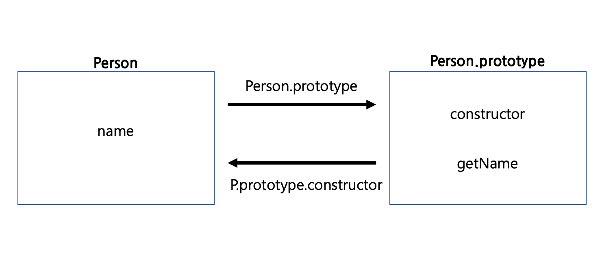

> 프로토타입은 객체다. **프로토타입이 무엇인가요?, 프로토타입에 대해 설명해주세요** 라는 질문은 너무 포괄적인 질문이다. 좋은 대답이 있듯이, 질문에도 퀄리티가 있다. 정확한 질문은 **'프로토타입 기반 언어인 Javascript에서, 프로토타입 객체 및 체이닝에 대해 설명해주세요'** 정도가 숨은 의도일 것이다. 프로토타입 객체와 체이닝이 어떤 형태로 동작하며, 이를통해 무엇을 할 수 있고, 어떤 장점이 있어서 사용하는지 이러한 디자인패턴을 만든 이유에 대해서 고민해보자.

## Function.Prototype
모든 함수는 프로토타입 객체를 가지고있다. 모든 함수는 `new` 키워드를 이용해 생성자 함수로써 사용될 수 있고, 그 반환값은 새로운 객체 `인스턴스`이다. 그리고 `__proto__(Dunder proto)` 라는 인스턴스의 멤버변수를 통해 자신을 생성한 생성자함수의 프로토타입객체에 접근이 가능하다. 해당 프로퍼티는 체이닝에 연결된 멤버변수, 메소드에 접근할 때 생략이 가능하지만, 프로토타입객체 자체에 접근하려면 반드시 명시해줘야 한다.



```javascript
function Person() {
  this.name = 'max';
}

var max = new Person();

Person.getTypeOf = 'Human';  // static method
typeof Person.prototype === 'object'; // prototype chaining method

Person.prototype // { constructor: ƒ Person }
Person.prototype.constructor === Person; // true
Object.getPrototypeOf(max) === Person.prototype; // true
```

프로토타입 객체는 항상 생성자 프로퍼티를 가지고있다. 생성자 프로퍼티는 함수 자기 자신이다.  
함수와 프로토타입 객체의 도식화는 아래 그림과 같다.


## Why use Prototype pattern
일반적으로 생성자 함수 내부에 멤버변수와 메소드를 구성하고 인스턴스를 여러개 생성한다고 해보자.
애초에 생성자 함수를 정의하는건, 1개 이상의 인스턴스를 생성하여 효율적으로 사용하겠다는 [OOP](https://ko.wikipedia.org/wiki/%EA%B0%9D%EC%B2%B4_%EC%A7%80%ED%96%A5_%ED%94%84%EB%A1%9C%EA%B7%B8%EB%9E%98%EB%B0%8D)적인 의도라고 봐도 무방하다. 여러 인스턴스는 독립적인 요소로 동작하는 절반의 성공을 거두었지만, 동일한 기능을 제공하는 메소드가 여러개 생성되어 메모리 문제가 발생했다고 볼수있다.


```javascript
function Person(name) {
  this.name = name || '';
  this.getName = function() { console.log(this.name) }
}

var max1 = new Person('max1'); // { name : 'max1', getName = function() { ... } }
var max2 = new Person('max2'); // { name : 'max2', getName = function() { ... } }

max1.getName === max2.getName // false


---- 프로토타입 객체를 이용해 개선한 코드 ----

function Person(name) {
  this.name = name || '';
}

Person.prototype.getName = function() { console.log(this.name) }

var max1 = new Person('max1'); // { name : 'max1' }
var max2 = new Person('max2'); // { name : 'max2' }

max1.getName === max2.getName // true

```

## Prototype Behavior Delegation ( !== Inheritance )
프로토타입 객체와 프로토타입 체인을 이용해 상속과 비슷한 **행동 위임 패턴**을 구현할 수 있다.
엄청난 무언가 숨은 코드가 아니라, 위임할 생성자 함수의 프로토타입 객체를 프로토타입 체이닝을 이용해 연결한것이다. 일반적인 OOP 에서의 상속과는 분명히 다른 개념이다. `__proto__` 를 통해 상위 프로토타입 객체의 멤버변수 또는 메소드에 접근할 수 있는 '권한'을 부여받을 뿐이다. 즉, 자기자신의 소유이냐 아니냐의 차이라고 볼 수 있다.

```javascript
function Person(name) { // 추상적인 부모 함수
    this.name = name || '';
}

Person.prototype.getName = function() { console.log(this.name) };

function Engineer(name, job) { // 부모 함수의 멤버변수와 메소드를 위임 할 함수
    Person.call(this, name);
    this.job = job;
}

// Behavior Delegation Setting
Engineer.prototype = Object.create(Person.prototype); // Person.prototype을 프로토타입으로 가진 새로운 객체
Engineer.prototype.constructor = Engineer; // 위에서 Person.prototype 참조값을 Engineer.prototype에 넣었기 때문에, 
                                           // constructor가 Person을 가리키는 상황이라, 
                                           // Engineer 생성자 함수를 다시 연결 해 줘야 한다.
// 체이닝이 필요한 메서드는 Behavior Delegation 과정 이후에

Engineer.prototype.getJob = function() { console.log(this.job); };
Engineer.prototype.getInfo = function() { console.log(this.name, this.job); }

var max1 = new Engineer('max1', 'fe engineer');
var max2 = new Engineer('max2', 'be engineer');

max1.__proto__ // Person { constructor: ƒ, getJob: ƒ, getInfo: ƒ }
max1.__proto__ === Engineer.prototype; // true
max1.__proto__.constructor === Engineer;

max1.__proto__.__proto__ // { getName: ƒ, constructor: ƒ }
max1.__proto__.__proto__ === Person.prototype; // true
max1.__proto__.__proto__.constructor === Person; // true

max1.__proto__ === max2.__proto__ // true
max1.__proto__.__proto__ === max2.__proto__.__proto__ // true

/**
 * Object.create(prototype) : prototype 객체를 가진 새로운 객체를 생성한다.
 * /
```

효율적으로 멤버변수 및 메소드를 관리한다는 측면에서 단점이 없어보이지만, 분명히 프로토타입 패턴의 단점도 존재한다. 자신의 상위 생성자함수의 프로토타입 객체에 접근하기 위한 시간이 분명히 존재한다. 물론, 체이닝의 단계가 지나치게 많을때를 말한다. 이는 곧 프로토타입 체이닝을 통한 지나친 위임설계에서 비롯된 단점이기때문에, OOP 관점에서 바람직한 설계를 고민한다면 애플리케이션마다 개선의 여지가 충분하다고 볼 수 있다.

## Class 
ES6에서는 프로토타입 기반의 클래스가 추가되었다. 결국 프로토타입의 연속이라고 볼 수 있다.

```javascript
class Person {
  constructor(name) {
    this.name = name || '';
  }

  static getTypeOf() { console.log('Human'); }
  getName() {
    console.log(this.name);
  }
  getArrowName = () => {
    console.log(this.name); // 이는 멤버함수로서 동작한다. 매우 중요.
  }
}
var max1 = new Person('max1');
var max2 = new Person('max2');

Person.getTypeOf // ƒ getTypeOf() { console.log('Person'); }
max1.getName === max2.getName; // true
max1.getArrowName === max2.getArrowName // false 
```

위에서 `Arrow Function`으로 메소드를 정의할 때 한가지 문제가 발생한다.
클래스 내부에서 화살표함수로 메소드를 정의하면, 내부적으로 `constructor`에 정의된다.
즉, 멤버변수의 일원으로써 정의된다는 뜻이다. (`defineProperty`)

```javascript
class Parent {
  this.getName = () => { console.log('Parent getName'); }
}

class Child extends Parent {
  getName() { console.log('Child getName') }
}

new Child().getName(); // Parent getName

---- 내부적으로 처리된 형태 ----
class Parent {
  constructor() {
  	this.getName = () => { console.log('Parent getName'); }
  }

}

class Child extends Parent {
  getName() { console.log('Child getName') }
}

new Child().getName(); // Parent getName

```
클래스 내부에서의 화살표함수로 정의된 메소드는 크게 2가지 문제점을 나타낸다.
1. Performance (프로토타입 체이닝이 아닌 각 인스턴스의 메소드로 동작한다.)
2. Inheritance Side-Effect (위 코드에서 볼 수 있는, `override`를 의도 한 코드의 )

## 정리
ES6에서 클래스가 스펙으로 추가된것이 무엇을 의미하는지 잘 생각해봐야하는 시점이다. 프로토타입 기반으로 클래스를 생성했기 때문에, **프로토타입 디자인 패턴을 잘 이해한것을 바탕으로 클래스를 이용한 OOP 설계를 바라는 것 같다**. OOP는 Javascript 객체를 관리함에 있어 매우 효율적인 패턴 중 하나라는건 부정할 수 없다. 장점과 단점이 존재하고, 의도를 분명히 하는 코드작성을 지향하라는 무언의 메세지가 아닐까.


## Reference

- https://developer.mozilla.org/ko/docs/Learn/JavaScript/Objects/Object_prototypes
- https://developer.mozilla.org/ko/docs/Web/JavaScript/Reference/Classes
- https://jsdev.kr/t/javascript-prototype/2853
- https://genekuo.medium.com/javascript-object-modelling-with-behavior-delegation-8be99da48432
- https://developer.mozilla.org/ko/docs/Web/JavaScript/Reference/Global_Objects/Object/create
- https://simsimjae.tistory.com/452