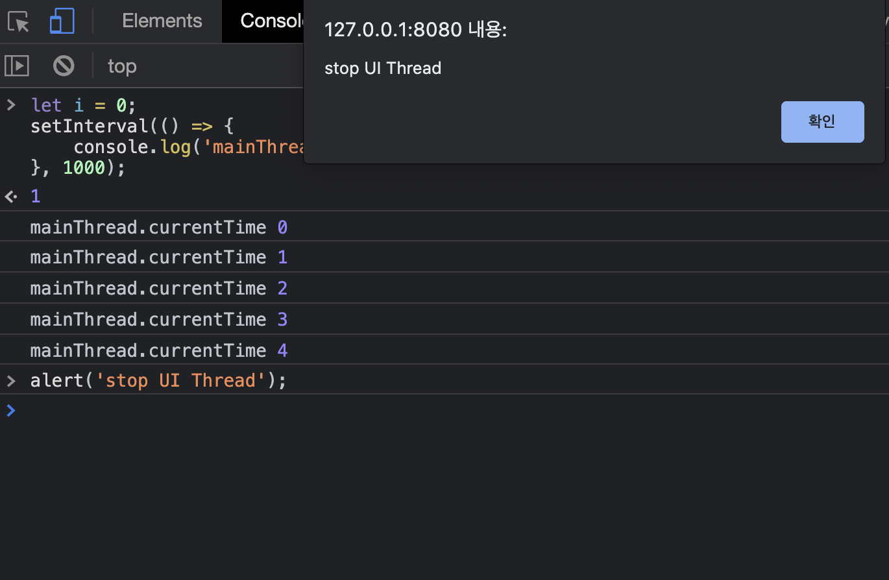
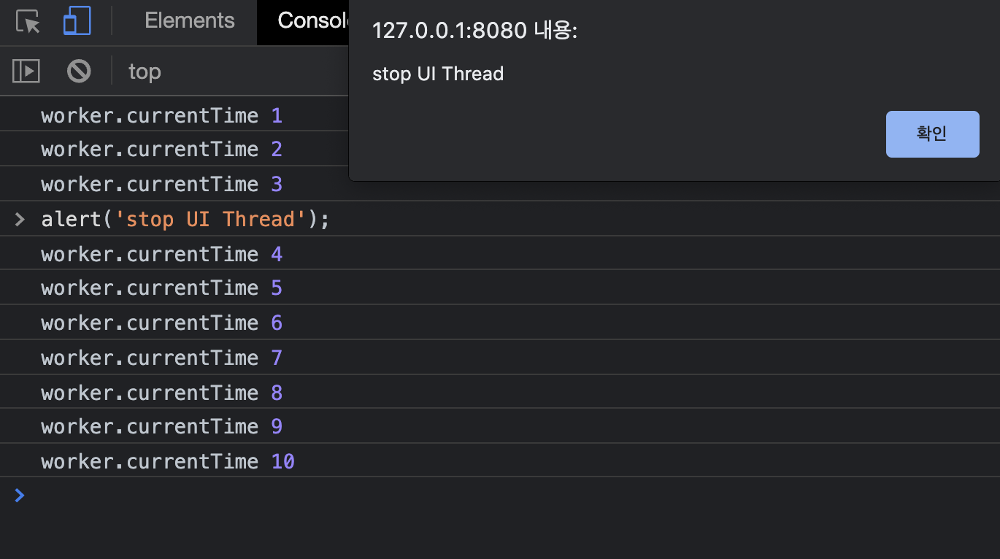

> 자바스크립트는 싱글스레드로 동작하지만 브라우저는 멀티스레드 환경에서 동작한다. Web API들을 이용해 동시성을 제공하는 비동기 프로그래밍을 구현해 왔는데, 워커를 이용하면 백그라운드 쓰레드에서 병렬적으로 작업을 진행할 수 있다. 물론 백그라운드에서 작업한 수행결과를 메인쓰레드로 가져오는 오버헤드도 고려해야하고, 싱글스레드 환경의 콜스택에서 테스크를 처리하는건 여전히 한 번에 하나인것을 잘 생각해서 구조를 설계해야한다. 

## When should i use Worker?

결론부터 말하자면 굳이 메인쓰레드에서 돌리고싶지 않은 작업들을 워커로 보내면 좋다.
1. 오랜시간 수행해야하는 작업
2. [OffscreenCanvas](https://developer.mozilla.org/ko/docs/Web/API/OffscreenCanvas)를 이용한 캔버스렌더링이 무거운 작업


## DedicatedGlobalScope
워커를 이용해 접근 가능한 쓰레드는 여러 종류가 있다. 그 중에서도 제일 기본적인 `new Worker`를 통해 생성되는 `WorkerGlobalScope`를 이용해 기본적인 타이머를 구현할수있다. 

`main.js`
```javascript
(function(main) {
	const start = document.querySelector('#start');
	const stop = document.querySelector('#stop');
	const time = document.querySelector('.time');
	
	let isStart = false;
	
	if (main.Worker) {
		const myWorker = new Worker("worker.js");
	
		start.onclick = function() {
			if (isStart) {
				myWorker.postMessage({ type: 'PAUSE' });
				start.textContent = '시작';
				isStart = false;
			} else {
				myWorker.postMessage({ type: 'START' });
				start.textContent = '일시정지';
				isStart = true;
			}
	
		}
	
		stop.onclick = function() {
			myWorker.postMessage({ type: 'STOP' });
			start.textContent = '시작';
			isStart = false;
		}
	
		myWorker.onmessage = function(e) {
			time.textContent = e.data;
		}
	} else {
		throw Error('Your browser doesn\'t support web workers.')
	}
	
})(window);
```

`worker.js`
```javascript

(function(worker) { // DedicatedWorkerGlobalScope
  worker.intervalID = null;
  worker.currentTime = 0;
  
  onmessage = function(e) {
    const result = e.data;
    const { type } = result;
  
    switch(type) {
      case 'START':
        worker.intervalID = this.setInterval(() => {
          worker.currentTime++;
          postMessage(worker.currentTime);
        }, 1000);
        
        break;
      case 'PAUSE':
        clearInterval(worker.intervalID);
        postMessage(worker.currentTime);
  
        break;
      case 'STOP':
        clearInterval(worker.intervalID);
        worker.intervalID = null;
        worker.currentTime = 0;
        postMessage(worker.currentTime);
        break;
      default:
        return;
    }
  }
})(self);

```

## only Main-Thread vs  with Worker-Thread

메인 쓰레드에서 `setInterval` API를 이용해 타이머를 생성할때와, 워커쓰레드에서 동일한 API를 이용해 타이머를 생성한 결과다. 일반적으로 `alert` 를 생성하면 싱글스레드로 동작하는 자바스크립트는 블로킹된다. 일반적인 싱글스레드 환경의 기대가능한 예제는 아래 스크린샷이다.



----

워커쓰레드에서 반복적인 타이머 작업을 돌리고, 해당 결과값만 메인쓰레드로 반환해주고 있는 결과다. 중요한건, 워커쓰레드에서 `setInterval` API가 계속 호출되고있는 '연산'자체는 블로킹되지 않는다. 즉, 메인쓰레드에서 실행시키기 부담스러운 연산 혹은 3d canvas 시각화 페인팅을 워커쓰레드로 옮겨서 작업하는것이 가능하다는것이다. 물론, 워커쓰레드에서 연산이 완료된 값을 메인쓰레드에서 받고, 돔을 조작하는 행동은 싱글스레드로 동작한다. 오해하면 안된다. **무거운 작업이 뒤에서 병렬로 돌아가는것이지, 실제 UI 화면을 구성하는것 까지 병렬적으로 진행되진 않는다.**



## Shared Worker
동일한 도메인 내에 존재하는 여러 Thread 에서 사용이 가능한 워커이며, `port`를 이용해 접근이 가능하다. 같은 도메인 내에서, 탭 UI 구현시 백그라운드에서 공유할 무거운 작업을 돌릴 때 활용이 가능하다.

`main.js`
```javascript
if (window.SharedWorker) {
    var worker = new SharedWorker('shared_worker.js');

    worker.port.postMessage();
    worker.port.onmessage = function (e) {
        console.log(e.data);
    }
}

```

`shared_worker`
```javascript
let count = 0;

onconnect = function (e) {
    var port = e.ports[0];
    port.onmessage = function (e) {
        port.postMessage(count++);
    }
}

```

## Offscreen Canvas
회사에서 스케치북 프로젝트를 할 때, 워커를 이용해 메인쓰레드에서 드로잉을 하지않고, 추가 쓰레드에서 드로잉을 프로토타입으로 제작해본적이 있다. 결과적으로 굳이 워커를 이용해 넘기지 않아도 16.6ms 이내에 들어오는 Background-Canvas 방법으로 구현하여 릴리즈 코드에 내보냈다. 또한, 서비스적으로 사파리 브라우저가 필수적으로 지원해야했는데, 워커는 사파리에서 돌아가질 않았다. 2D 작업을 넘어, 3D webgl이나 끊임없이 연산해야하는 캔버스를 만들경우 사용하면 좋을것같다.

`Canvas code`
```javascript
const canvas = document.createElement('canvas');
const offscreen = canvas.transferControlToOffscreen();
document.body.appendChild(canvas);

const worker = new Worker('offscreencanvas.js');

worker.postMessage({
  action: 'init',
  canvas: offscreen, 
  width: window.innerWidth, 
  height: window.innerHeight 
}, [offscreen]); // offscreen을 워커로 넘겨버리고 나면, 해당 캔버스를 사용할수없다.

document.addEventListener('mousemove', draw);
document.addEventListener('mousedown', set);
document.addEventListener('mouseenter', set);

function set(e) {
  worker.postMessage({ 
    action: 'set',
    x: e.clientX,
    y: e.clientY,
  });
}

function draw(e) {
  if (e.buttons !== 1) return
  worker.postMessage({
    action: 'draw',
    x: e.clientX,
    y: e.clientY,
  });
}
```

`offscreen-canvas-Worker.js`
```javascript
const pos = { x: 0, y: 0 };
let ctx = null;

/* 
  메세지를 받는 방식은 동일하다.
*/
onmessage = function(evt) {
  const {action, width, height, x, y} = evt.data;
  switch(action) {
    case 'init':
      ctx = evt.data.canvas.getContext('2d');
      ctx.canvas.width = width;
      ctx.canvas.height = height;
      break;
    case 'set':
      setPosition(x, y);
      break;
    case 'draw':
      draw(x, y);
      break;
    default:
      return;
  }
}

function setPosition(x, y) {
  pos.x = x;
  pos.y = y;
}

function draw(x, y) {
  ctx.beginPath(); // begin

  ctx.lineWidth = 5;
  ctx.lineCap = 'round';
  ctx.strokeStyle = '#c0392b';

  ctx.moveTo(pos.x, pos.y); // from
  setPosition(x, y);
  ctx.lineTo(pos.x, pos.y); // to

  ctx.stroke(); // draw it!
}
```

## 정리
사파리는 제외하더라도, 크롬에서 오프스크린을 사용했어야 했나? 라는 스스로의 물음에, 나는 백번을 돌아가도 아니라고 할것같다. 오버 엔지니어링은 언제나 조심해야한다. 릴리즈 버전은 나의 플레이그라운드가 아니라, 항상 Stable 해야한다는것이 첫번째 이유다. 브라우저를 분기하여 적용하면 Stable 하지 않냐? 라는 추가적인 물음에도 아니라고 생각한다. 코드량이 늘어나는것은 결코 피할수 없을것이고, 해당 코드는 대형 서비스에 임포트하여 릴리즈하기 때문에, 조금이라도 용량을 줄여야하는게 필요했다. 또한 워커쓰레드를 추가하면서 관리를 위한 클래스를 생성하고, 추가적인 메모리를 사용하고, 메인쓰레드 <-> 워커 간 오버헤드를 고려한다면 분명 비용은 발생한다. 오버 커뮤니케이션은 언제든 좋지만, 오버 엔지니어링은 개발자로서 욕심을 버리고 항상 경계해야하지 않을까 싶다.


## Reference
- https://developer.mozilla.org/ko/docs/Web/API/Web_Workers_API
- https://developer.mozilla.org/ko/docs/Web/API/OffscreenCanvas
- https://d2.naver.com/helloworld/2922312
- https://deview.kr/2018/schedule/259
- https://threejsfundamentals.org/threejs/lessons/kr/threejs-offscreencanvas.html