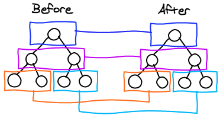

> 리액트의 장점 중 하나는 단연 Virtual DOM을 이용한 리렌더링 성능이다. 근데 왜 좋다고 하는걸까? `diffing`이라는 수행 자체도 분명 비용이다. 비용을 줄이기 위한 내부 알고리즘. 어떤식으로 동작하는지 이해해보자.

## Reconciliation

리액트 공식문서에서도 설명되어있듯이, 일반적으로 `DOM` 트리를 탐색하고 비교하는 알고리즘이 이미 존재하며, 해당 알고리즘는 `O(n^3)` 시간복잡도를 갖는다. 하지만 리액트의 휴리스틱 알고리즘을 통해 `O(n)`까지 줄이는 데 성공했다고 한다. 시간복잡도를 유추 해 봤을때, 굉장히 선형적인 구조의 diffing이 예상되며, 실제로 다음과 같은 절차를 거친다고한다.

- 노드의 타입이 다르다면, 자식 노드는 비교조차 하지 않는다.
- 노드의 타입이 같다면, `VirtualDOM`의 프로퍼티만 변경한 후 `ReadDOM`에 반영한다.
- 각 노드에 부여된 Key값을 이용해 바로 접근 및 비교가 가능하다.

--- 

### 1.1 노드의 타입이 다르다면, 자식 노드는 비교조차 하지 않는다.



`O(n)` 복잡도라면 어느정도 예상할 수 있는 그림이다. 리액트에서는 엘리먼트의 루트 엘리먼트끼리 비교한다. 이때 엘리먼트의 타입 자체가 달라진다면, 내부 컴포넌트부터 state까지 모두 언마운트 되고 사라지며, 새로 그리게 된다. 즉, 일반적인 DOM diffing 보다 새로 그리는 비용이 적게 들어가는것이다.

```javascript
<div>
  <Counter />
</div>

<span> // 부모 엘리먼트의 '타입'만 변경되었다.
  <Counter />
</span>

```

여기서 HTML 문서는, W3C 에서 정의한 `웹표준`이란것이 있다. 웹 표준에 의거하여 각 엘리먼트는 나름의 규칙이 있다. `<ul>` 태그와 `<li>`, `<div>`-`<span>`엘리먼트의 박스모델링 차이 등 위에 엘리먼트 타입이 변경된 것만 놓고 보아도, `display: block` -> `display: inline` 방식으로 변경되었음을 리액트는 또 계산해야하며, 이러한 계산보다 새로 생성하는것이 낫다고 판단한것이다.

--- 

### 1.2 DOM 엘리먼트 타입이 같은 경우

리액트는 컴포넌트 또는 DOM 타입이 바뀌지 않는다면, VirtualDOM의 프로퍼티만 변경하여 최소한의 변경사항만 업데이트한다. 이는 VirtualDOM을 사용하는 이점인데, 모든 컴포넌트에 걸친 업데이트가 종료될 때 까지 변경사항들을 각 VirtualDOM에 기록해두었다가, 업데이트가 모두 종료될 때 한번의 Real DOM으로의 렌더링을 시도한다. 즉, RealDOM 조작에 따른 오버헤드를 최소한으로 줄일 수 있는것이다.

```javascript
<div className="before" title="stuff" />
// className만 변경
<div className="after" title="stuff" />


<div style={{color: 'red', fontWeight: 'bold'}} />
// style 객체 내부의 color값만 변경
<div style={{color: 'green', fontWeight: 'bold'}} />

```

```javascript
// virtual DOM의 예
// 변경사항이 있으면 실제 DOM을 조작하지 않고 virtual DOM 객체 프로퍼티만 변경합니다
// render는 모든 프로퍼티 변경이 끝난 뒤에 전체를 취합해 한번만 이루어집니다
function render(count)  {
    return h('div', {
        style: {
            textAlign: 'center',
            lineHeight: (100 + count) + 'px',
            border: '1px solid red',
            width: (100 + count) + 'px',
            height: (100 + count) + 'px'
        }
    }, [String(count)]);
}

```

--- 

### 2. 각 노드에 부여된 Key값을 이용해 바로 접근 및 비교가 가능하다.

리액트를 개발할때 한번쯤 **key값에 인덱스를 넣지 마세요** 라는 기본적인 안티패턴 경고문구를 접할 수 있다. 이는 곧 성능과 직결된 문제인데, 독립적인 `KEY`를 매칭해두면, 추가 렌더링을 피하게된다.

```javascript
{/*
  사람이 볼땐 zero 노드가 최상단에 추가되었다고 알지만,
  리액트의경우 전체 요소가 변경된거라고 인식하게된다.
 */}
<ul>
  <li>zero</li>
  <li>first</li>
  <li>second</li>
</ul>
⬇︎
<ul>
  <li>first</li>
  <li>second</li>
</ul>

---- KEY 매칭 ----
{/*
  변경을 예견하여 key값을 독립적인 값으로 매칭시켜둔다면, 
  기존 노드를 리렌더링하지 않는다.
 */}
<ul>
  <li key="a">first</li>
  <li key="b">second</li>
</ul>
⬇︎
<ul>
  <li key="c">zero</li> // KEY값을 보고 추가됨을 인지
  <li key="a">first</li> // 순서만 변경
  <li key="b">second</li>  // 순서만 변경
</ul> 

```

## So, What is Best ?
`diffing` 알고리즘이 `O(n)`의 성능을 가진다지만, 제일 최선의 방법은 리렌더링을 하지 않는것이다. 리액트에서도 충분히 권장하고있으며, `ShouldComponentUpdate(nextProps, nextState)` 함수를 통해 제어함을 추천한다. SCU의 parameter를 이용해 props, state 값의 변경을 비교할 수 있으며 세밀한 리렌더링 컨트롤이 가능하다. 이때 `PureComponent`, `React.memo`를 사용할 수도 있다. `PureComponent`는 `shallow-compare` 방식의 SCU가 이미 탑재된 컴포넌트라고 이해하면된다.  

아래의 익명함수는, props로 전달될 때 마다 새로운 레퍼런스를 갖게된다. 즉 하위 PureComponent 는 새로운 props를 받았다고 인지하여 매번 리렌더링하게된다. 마찬가지로 다른 props도 인라인방식으로 내려주면 리렌더링을 발생시킨다. 또한, 편하다고 무조건 PureComponent를 사용해야하는건 아니다. 앞서 말했듯이 SCU가 내장되어있고, SCU 연산을 하는것 자체가 이미 비용이다. 

`removeItem={() => this.removeItem()}`
```javascript
class Item extends React.PureComponent {
  ...
}

class List extends React.Component {
  ...
  render() {
    return (
      <div>
        <Item item={this.state.item} removeItem={() => this.removeItem()} />
      </div>
    )
  }
}
```

[Compare code](https://codesandbox.io/s/withered-frost-92f0k?file=/src/App.js)

## React.Memo
동작원리자체는 조금 다르지만, 용도는 거의 같다. 부모 컴포넌트가 리렌더링 될 때, Memized Component가 전달받는 props가 동일하다면 렌더링하지 않고 마지막 렌더링된 결과를 재사용한다. `React.memo`는 `props` 변화에만 영향을 받는다. 


```javascript
function MyComponent(props) {
  /* props를 사용하여 렌더링 */
}
function areEqual(prevProps, nextProps) {
  /*
  nextProp가 prevProps와 동일한 값을 가지면 true를 반환하고, 그렇지 않다면 false를 반환
  SCU와 정 반대의 동작을 한다. 
  하지만 성능최적화를 위한 목적은 동일하다.
  */
}
export default React.memo(MyComponent, areEqual);
```

[Memo code](https://codesandbox.io/s/confident-tdd-7sftm?file=/src/App.js)

## 정리

- PureComponent를 무분별하게 쓰지 말자.
  - 인라인방식으로 props를 넘기면 새로운 레퍼런스를 생성한다
  - 항상 리렌더링 될 만한 컴포넌트는 일반 컴포넌트로 생성하자. SCU도 비용이다.

## Reference
- https://ko.reactjs.org/docs/reconciliation.html
- https://github.com/Matt-Esch/virtual-dom
- https://www.huskyhoochu.com/virtual-dom/
- https://meetup.toast.com/posts/110