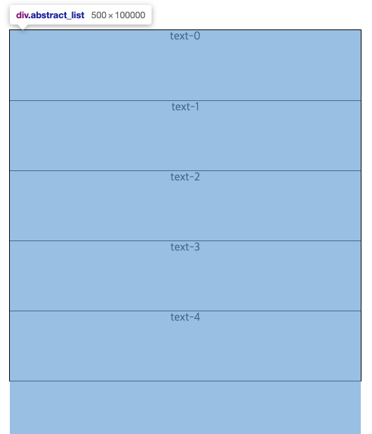

> 보통 웹 페이지의 스크롤이 최하단에 위치할 때, 데이터를 추가로 로드하고 화면에 렌더링하는 형식을 무한스크롤 방식이라고 한다. 기존의 페이지네이션 방식의 리스트 노출방식과 비교하여 UX부분의 이점이 두드러지며 초기 렌더링 성능을 가질 수 있다. 현재까지 로드 한 시점의 기준점으로 `offset`을 두고, 필요한 구간의 데이터를 서버쪽에 요청하는 형식이다. 


## offset을 이용하지 않은 무한스크롤 방식
비디오 영상을 서버에 업로드하면, 영상에서 등장하는 모든 텍스트를 JSON 파일로 내려주는 서비스를 개발한 적이 있었다. 이때 서비스에서 리스트를 뿌려주는 api의 특징은 다음과 같았다.

1. 영상의 길이 및 내부 컨텐츠에 따라 리스트의 길이는 수만개까지 내려올 수 있다.
2. 리스트를 내려줄 때 `offset` 값이 없어서, 클라이언트에서 알아서 구분해야했다.
3. Youtube 서버스의 `timestamp` 기능처럼, 영상 내 특정 시간을 클릭하면 해당 데이터를 노출하는 리스트로 이동해야한다.


## 구현방식

1. `timestamp` 는 리스트의 중요한 Key값, 달리말해 무한스크롤의 `offset`으로써 역할을 대신했다.
2. 무한스크롤 처럼 UX가 동작하지만, 실제 화면에 뿌려주는 돔의 갯수는 고정시킨다.
3. 많게는 천여개, 만여개 이상의 데이터를 전부 렌더링 할 필요도 없었으며, 영상 내 특정 시간을 클릭했을 때 원하는 데이터를 노출하는 스펙을 지원할 수 있었다.


## 화면 개요


- 고정된 높이값을 가진 `wrapper` 엘리먼트
- 고정된 갯수의 리스트 엘리먼트
- **고정된 갯수 * 실제 데이터 갯수**를 이용해 높이값을 미리 계산해 둔 `virtual-list`  


----


#### 1. 고정된 높이값을 가진 `wrapper` 엘리먼트
높이값이 `100px`인 리스트를 5개만 노출할 목적으로, wrapper 엘리먼트를 생성하고 `overflow:hidden` 해두었다.


#### 2. 고정된 갯수 * 실제 데이터 갯수를 이용해 높이값을 미리 계산해 둔 `virtual-list`
위 개요의 사진상으로는 맨 뒤에 위치하지만, 실제 돔 구조는 wrapper 바로 자식요소로 위치한다. 미리 높이값을 계산해두었기 때문에, 사용자는 UX적으로 스크롤되는 경험을 제공받을 수 있으며, 무한스크롤 기능을 사용하는것 처럼 느낄 수 있다.



#### 3. 고정된 li 엘리먼트를 렌더링해두고, 내부 자식요소만 변경하는 ul 엘리먼트
`absolute` 스타일을 적용해서, 전체를 그려둔 가상 리스트 내에서 절대적인 위치에 배치시킬 수 있다. `slice` 함수를 이용해 전체 데이터를 계속해서 갱신해주며, 내부적으로 `memoization` 하거나, `key`값을 좀더 세심하게 매핑하여 리렌더링 성능을 향상시킬 수 있다. 아래 예시는 실제 코드가 아닌 데모 코드다.


#### 3-1. 스크롤을 움직이고 갱신된 ul 엘리먼트


## 소스코드
https://codesandbox.io/s/virtual-infinite-scroll-6vifj

```javascript
import { useEffect, useState, useMemo } from "react";
import throttle from "lodash.throttle";
import "./styles.css";

const offset = 10; // 한번에 노출하려는 offset
const itemHeight = 100; // 고정 list-item의 각 높이값

const getDataHeight = (length) => {
  return itemHeight * length;
};

const data = [];
// DUMMY_DATA
new Array(1000).fill(1).forEach((n, index) => {
  const obj = {
    index: index,
    id: `ID-${index}`,
    text: `text-${index}`
  };

  data.push(obj);
});

export default function App() {
  const [startIndex, setStartIndex] = useState(0);
  const [endIndex, setEndIndex] = useState(startIndex + 5);
  const abstractListHeight = useMemo(() => getDataHeight(data.length), data);

  const abstractListStyle = {
    height: `${abstractListHeight}px`
  };

  const handleScroll = throttle((e) => {
    requestAnimationFrame(() => {
      const { scrollTop } = e.target;
      const startIndex = Math.floor(scrollTop / itemHeight);

      setStartIndex(startIndex);
      setEndIndex(startIndex + offset);
    });
  }, 300);

  useEffect(() => {
    const listWrapElement = document.querySelector(".list_wrap");
    listWrapElement.addEventListener("scroll", handleScroll);

    return () => {
      listWrapElement.removeEventListener("scroll", handleScroll);
    };
  }, []);

  const list = data.slice(startIndex, endIndex); // 전체 데이터를 slice

  return (
    <div className="App">
      <div className="list_wrap">
        <div className="abstract_list" style={abstractListStyle}>
          <ul className="real_list">
            {list.map(({ index, id, text }) => {
              const style = {
                position: 'absolute',
                top: `${itemHeight * index}px`
              };
              return (
                <li style={style} className={"li"} key={id}>
                  {text}
                </li>
              );
            })}
          </ul>
        </div>
      </div>
    </div>
  );
}

```

## 정리
무한스크롤을 일반적인 방식과 다르게 구현해보았다. 서버쪽 코드를 변경할 수 없는 상황에 적용할 수 있는 무한스크롤 방식이었으며, 백오피스 스펙으로 이슈없이 잘 사용할 수 있었다.

