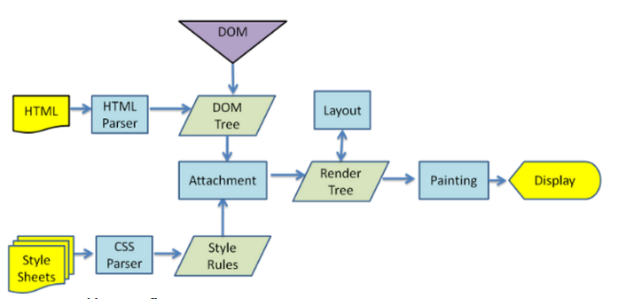

> **주요 렌더링 경로 최적화** 
> HTML, CSS, Javascript 코드를 브라우저가 렌더링 하는 일련의 파이프라인 과정

- DOM : HTML 문서의 객체 모델
- CSSOM : CSS 문서의 객체 모델

  

## DOM (Document Object Model)
1. **변환** : 텍스트 문서를 읽고, 각각의 문자열로 변환합니다.  
  `3C 62 6F` -> `<html><head> ... </head></html>`  
  
    
2. **토큰화** : 변환된 문자열을 W3C 표준에 맞게 토큰으로 변환합니다.  
  `<html><head> ... </head></html>`   
  ->  
  `[StartTag: html][StartTag: head] ... [EndTag: head][EndTag: html]`

3. **렉싱** : 각 토큰을 하나의 노드 객체로 변환합니다.  
  `{ html } { head } ... `

4. **DOM 생성** : HTML 문서 태그간의 관계를 정의하기 위해 트리형태 구조로 연결합니다.

5. 1 ~ 4 과정을 통해 브라우저에서 접근 가능한 DOM 을 출력하고, 자바스크립트를 이용해 접근 및 제어합니다. 하지만 DOM은 '어떻게 렌더링 될지' 에 대한 정보는 알려주지 않고, CSSOM에 의존하여 렌더링됩니다.


## CSSOM (CSS Object Model)
```css
body { font-size: 16px }
p { font-weight: bold }
span { color: red }
```

1. CSS 문서도 HTML 문서와 동일한 과정으로 CSS Object Model을 생성합니다.
2. CSS Object Model이 **왜 트리구조인가**?
  2.1. 기본적으로 1:1 스타일 매칭을 한다 (`body {} ` < - > `<body>`)
  2.2. 흔히 **상속**되는 속성을 각 브라우저에서 구현함으로써, '**하향식**'으로 적용되는 규칙을 통해 최적화


## Redner Tree


- DOM + CSSOM 결합
- 렌더트리는 **화면에 실제로 렌더링** 할 노드만 포함하여 트리구조로 형성
  - `<script>`, `<meta>` 태그 등 렌더링 출력에 반영되지 않는 노드는 생략합니다.
  - `span { display : none }` 처럼, CSS를 통해 화면에 렌더링되지 않는 노드는 생략합니다. 


## Layout / Reflow
- 레이아웃 / 리플로우 : 노드의 정확한 **위치** 및 **크기(박스모델)** 계산
- 위치와 크기를 계산하기 위해 루트에서 렌더트리를 순회합니다.
- `%`를 이용한 계산식이, **픽셀단위의 절대값**으로 변환됩니다.
- Firefox : 리플로우
- IE, Chrome, Safari, Opera : 레이아웃


## Painting / Rasterize
- 각 노드의 박스모델과 위치를 참고하여 실제 화면에 픽셀화 하는 작업
- Layout 과정이 완료되면 브라우저가 `Paint Setup`, `Paint` 이벤트를 발생


## 결론
Critical Rendering Path 최적화란, 결국 위 단계의 수행 시간을 최소화 하는 프로세스입니다. 


## Reference
- [MDN 객체모델 생성](https://developers.google.com/web/fundamentals/performance/critical-rendering-path/constructing-the-object-model?hl=ko)

- [렌더링 트리 생성, 레이아웃 및 페인트](https://developers.google.com/web/fundamentals/performance/critical-rendering-path/render-tree-construction?hl=ko)