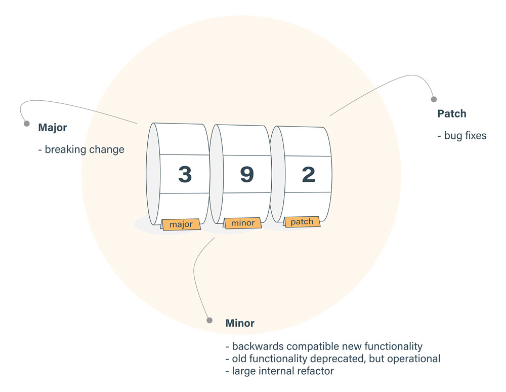
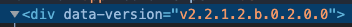
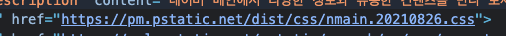

> Semantic Versioning
> 소프트웨어 뿐만 아니라, 모든 제품을 출시할 때 버전관리는 중요하다. 명시된 버전을 통해 제품의 어떤 특징이 생겼는지 유추해 볼 수 있다. 프론트엔드 개발을 하다보면, 새로운 기능을 검증하기 위해 테스트 서버에 배포해야 하는 상황이 존재한다. 이때, 버저닝을 적용 해 두면 직관적으로 정상배포가 되었음을 인지할 수 있다. 시맨틱 버저닝의 요소에 대해 알아보고, 적용 방법을 고민해보자.

## Semantic Versioning 구성 요소

### 1. Major

기존 버전과 호환되지 않게 API가 바뀌면 “주(主) 버전”을 올린다.  
보통 대대적인 서비스 오픈, 개편 상황에 올린다.

### 2. Minor

기존 버전과 호환되면서 새로운 기능을 추가할 때는 “부(部) 버전”을 올린다.
단어 그대로 새로운 기능이 추가되는 경우 올린다.

### 3. Patch

기존 버전과 호환되면서 버그를 수정한 것이라면 “수(修) 버전”을 올린다.
버그픽스 및 유지보수 상황에 올린다.

## Semantic Versioning 적용 방법

### 1. HTML 파일 내에 버전 노출

배포시 HTML 파일의 속성값으로 버전을 추가하여, 직관적으로 정상배포가 되었음을 확인할 수 있다.

### 2. JS 파일명에 버전 노출

배포시 정적 파일의 파일명 뒤에 날짜를 표기한다. 날짜와 난수를 더해 잦은 배포에 대비할 수 있다.

### 3. 개발자도구의 콘솔창에 버전 노출

개발자도구의 콘솔창에 버전 로그를 찍을 수 있다. 폰트 사이즈와 색깔을 이용해 버전뿐만 아니라 사용자에게 메세지를 전달할 수 있다.

## Reference

- https://developer.chrome.com/docs/devtools/console/log/
- https://semver.org/lang/ko/
- https://feel5ny.github.io/2021/02/23/standard-version/
